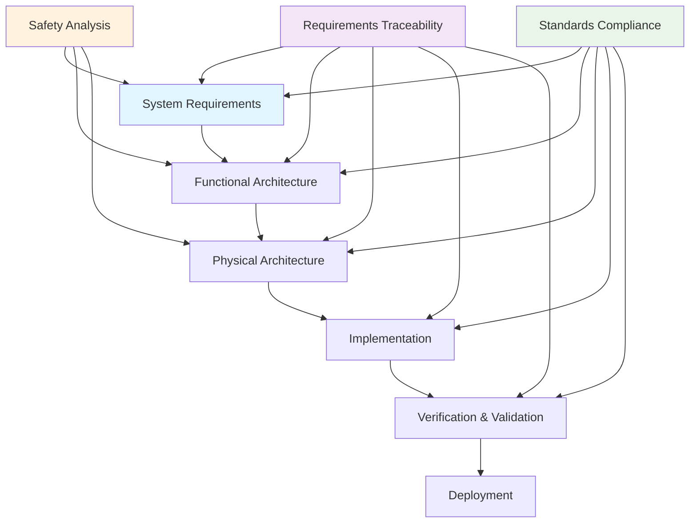
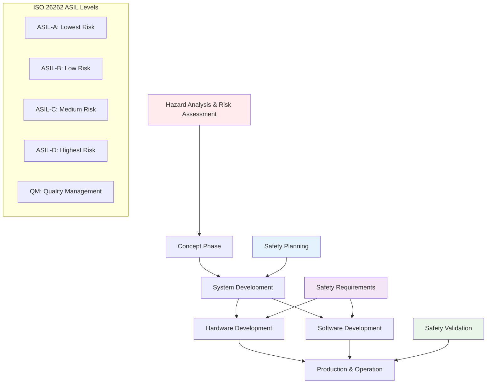
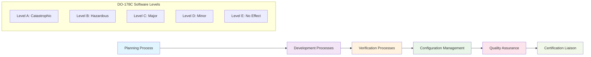
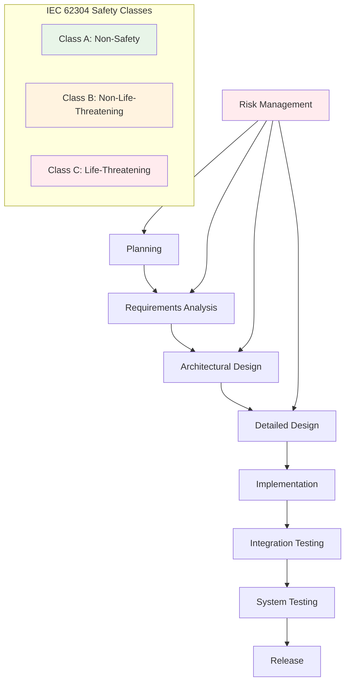
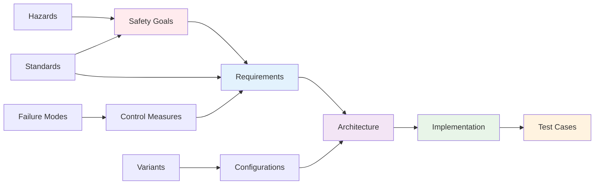
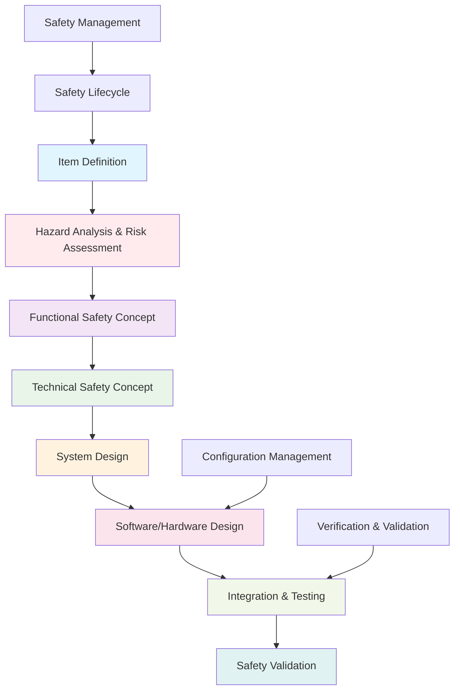
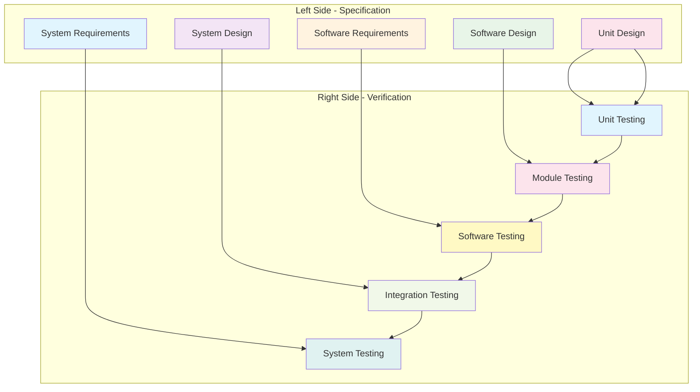
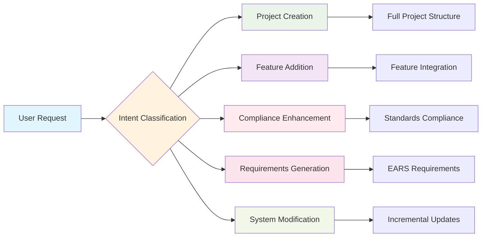

# Sylang: Model Based Systems Engineering Language

**The Complete MBSE Toolkit for Safety-Critical Industries**

Welcome to **Sylang** - the revolutionary domain-specific language designed for **Model Based Systems Engineering (MBSE)** across **Automotive**, **Aerospace**, and **Medical** industries. Transform complex system requirements into traceable, standards-compliant engineering artifacts with AI-powered intelligence.

## 🚀 What is Model Based Systems Engineering?

Model Based Systems Engineering (MBSE) is a methodology that uses digital models as the primary means of information exchange, system development, and verification. Unlike traditional document-based approaches, MBSE provides:



### Why MBSE Matters in Safety-Critical Industries

- **🎯 Traceability**: Complete requirement-to-implementation traceability
- **🔄 Consistency**: Single source of truth across all engineering disciplines
- **⚡ Efficiency**: Automated generation of documentation and verification artifacts
- **🛡️ Safety**: Built-in safety analysis and standards compliance
- **🔧 Collaboration**: Unified language across multidisciplinary teams

## 🏭 Industry Applications & Standards

### 🚗 Automotive Industry (ISO 26262)

The automotive industry demands **functional safety** compliance for safety-critical systems. Sylang supports the complete **ISO 26262** workflow:



**Example Systems:**
- **Electric Parking Brake (EPB)** - ASIL-D
- **Electric Power Steering (EPS)** - ASIL-D
- **Brake-by-Wire (BBW)** - ASIL-D
- **Advanced Driver Assistance Systems (ADAS)** - ASIL-B to ASIL-D
- **Autonomous Driving Functions** - ASIL-D

### ✈️ Aerospace Industry (DO-178C)

Aerospace systems require **airworthiness certification** under **DO-178C** standards:



**Example Systems:**
- **Flight Control Systems** - Level A
- **Engine Control Units** - Level A
- **Navigation Systems** - Level B
- **Communication Systems** - Level C
- **Passenger Entertainment** - Level E

### 🏥 Medical Device Industry (IEC 62304)

Medical devices must comply with **IEC 62304** for software lifecycle processes:



**Example Systems:**
- **Pacemakers** - Class C
- **Surgical Robots** - Class C
- **Patient Monitoring** - Class B
- **Diagnostic Equipment** - Class A
- **Infusion Pumps** - Class C

## 📋 Complete Sylang File Type Reference

Sylang provides **15 specialized file extensions**, each designed for specific engineering domains:

### 🏗️ System Architecture Files

#### `.ple` - Product Line Engineering
**Purpose**: Define product line architecture and metadata
**Usage**: ONE per workspace (top-level system definition)

```sylang
productline <ProductLineName>
  name <string_literal>
  description <string_literal>
  owner <string_literal>
  domain <domain_list>
  compliance <standards_list>
  firstrelease <date_string>
  safetylevel <safety_level>
  region <region_list>
  tags <tag_list>
```

**Keywords Explained:**
- `productline` - Root definition keyword
- `name` - Human-readable product line name
- `description` - Detailed purpose and scope
- `owner` - Responsible engineering team
- `domain` - Application domains (automotive, aerospace, medical)
- `compliance` - Standards compliance (ISO 26262, DO-178C, IEC 62304)
- `firstrelease` - Planned first release date (YYYY-MM-DD)
- `safetylevel` - Highest safety level (ASIL-A/B/C/D, QM)
- `region` - Target markets
- `tags` - Classification tags

#### `.fml` - Feature Modeling
**Purpose**: Define variability and feature selection
**Usage**: Multiple files for complex product lines

```sylang
def featureset <FeatureSetName>
  def feature <FeatureName> <variability_type>
    name <string_literal>
    description <string_literal>
    owner <string_literal>
    tags <tag_list>
    safetylevel <safety_level>
    
    def feature <ChildFeature> <variability_type>
      # Nested feature hierarchy
```

**Variability Types:**
- `mandatory` - Must be included in all variants
- `optional` - May be included
- `alternative` - Exactly one from group
- `or` - One or more from group

### 🎯 Functional Design Files

#### `.fun` - Function Definitions
**Purpose**: Define system functions and behaviors
**Usage**: Multiple files organized by subsystem

```sylang
def functiongroup <FunctionGroupName>
  def function <FunctionName>
    name <string_literal>
    description <string_literal>
    owner <string_literal>
    safetylevel <safety_level>
    inputs <parameter_list>
    outputs <parameter_list>
    preconditions <condition_list>
    postconditions <condition_list>
    enables <feature_reference>
```

**Function Properties:**
- `inputs` - Function input parameters with types
- `outputs` - Function output parameters with types
- `preconditions` - Conditions that must be true before execution
- `postconditions` - Conditions guaranteed after execution
- `enables` - Features this function enables

### 🛡️ Safety Engineering Files (Ordered by Workflow)

#### `.itm` - Safety Items
**Purpose**: Define safety-related system elements
**Usage**: First step in safety analysis

```sylang
def safetyitems <SafetyItemsName>
  def safetyitem <ItemName>
    name <string_literal>
    description <string_literal>
    category <item_category>
    safetylevel <safety_level>
    functions <function_list>
    interfaces <interface_list>
```

#### `.haz` - Hazard Analysis
**Purpose**: Identify and analyze system hazards
**Usage**: Second step - identify hazards

```sylang
def hazards <HazardsName>
  def hazard <HazardID>
    name <string_literal>
    description <string_literal>
    category <hazard_category>
    cause <cause_description>
    effect <effect_description>
    severity <severity_level>
    exposure <exposure_level>
    controllability <controllability_level>
    functions_affected <function_list>
```

**Severity Levels (ISO 26262):**
- `S0` - No injuries
- `S1` - Light to moderate injuries
- `S2` - Severe to life-threatening injuries
- `S3` - Life-threatening to fatal injuries

#### `.rsk` - Risk Assessment
**Purpose**: Assess and categorize risks
**Usage**: Third step - quantify risks

```sylang
def riskassessment <RiskAssessmentName>
  def risk <RiskID>
    name <string_literal>
    description <string_literal>
    hazard <hazard_reference>
    severity <severity_level>
    exposure <exposure_level>
    controllability <controllability_level>
    asil <asil_level>
    risklevel <risk_level>
```

#### `.sgl` - Safety Goals
**Purpose**: Define safety objectives
**Usage**: Fourth step - establish safety goals

```sylang
def safetygoals <SafetyGoalsName>
  def safetygoal <GoalID>
    name <string_literal>
    description <string_literal>
    safetylevel <safety_level>
    allocatedto <component_list>
    derivedfrom <requirement_list>
    verifiesby <verification_list>
```

#### `.req` - Requirements
**Purpose**: Detailed functional and safety requirements
**Usage**: Fifth step - specify requirements

```sylang
def requirements <RequirementsName>
  def requirement <RequirementID>
    name <string_literal>
    description <string_literal>
    type <requirement_type>
    safetylevel <safety_level>
    rationale <string_literal>
    specification <string_literal>
    allocatedto <component_list>
    satisfies <safety_goal_reference>
    derivedfrom <parent_requirement>
    verificationcriteria <criteria_list>
```

**Requirement Types:**
- `functional` - Functional requirements
- `safety` - Safety requirements
- `performance` - Performance requirements
- `interface` - Interface requirements

#### `.fta` - Fault Tree Analysis
**Purpose**: Analyze failure propagation
**Usage**: Final step - failure analysis

```sylang
def faulttree <FaultTreeName>
  name <string_literal>
  description <string_literal>
  topevent <event_name>
  
  def event <EventName>
    name <string_literal>
    description <string_literal>
    type <event_type>
    probability <probability_value>
    gate <gate_type>
    inputs <event_list>
```

**Gate Types:**
- `AND` - All inputs must occur
- `OR` - Any input can cause event
- `XOR` - Exactly one input
- `INHIBIT` - Conditional gate

### 🔧 Implementation Files

#### `.sys` - System Definitions
**Purpose**: Define system architecture and subsystems
**Usage**: Multiple files for complex systems

```sylang
def system <SystemName>
  name <string_literal>
  description <string_literal>
  owner <string_literal>
  safetylevel <safety_level>
  
  def subsystem <SubsystemName>
    name <string_literal>
    description <string_literal>
    owner <string_literal>
    safetylevel <safety_level>
    interfaces <interface_list>
```

#### `.sub` - Subsystem Definitions
**Purpose**: Detailed subsystem specifications
**Usage**: One file per major subsystem

```sylang
def subsystem <SubsystemName>
  name <string_literal>
  description <string_literal>
  owner <string_literal>
  safetylevel <safety_level>
  partof <parent_system>
  
  def component <ComponentName>
    name <string_literal>
    description <string_literal>
    type <component_type>
    safetylevel <safety_level>
```

#### `.blk` - Block Definitions
**Purpose**: Define reusable system blocks
**Usage**: Library of reusable components

```sylang
def block <BlockName>
  name <string_literal>
  description <string_literal>
  type <block_type>
  
  def interface <InterfaceName>
    name <string_literal>
    type <interface_type>
    direction <direction_type>
    protocol <protocol_type>
```

**Interface Types:**
- `Digital` - Digital signals
- `Analog` - Analog signals
- `Power` - Power interfaces
- `Mechanical` - Mechanical interfaces
- `Thermal` - Thermal interfaces

#### `.tst` - Test Cases
**Purpose**: Define verification and validation tests
**Usage**: Comprehensive test coverage

```sylang
def testcases <TestCasesName>
  def testcase <TestCaseID>
    name <string_literal>
    description <string_literal>
    type <test_type>
    priority <priority_level>
    safetylevel <safety_level>
    
    def step <StepID>
      action <string_literal>
      expected <string_literal>
      actual <string_literal>
```

### 🔄 Failure Analysis Files

#### `.fma` - Failure Mode Analysis
**Purpose**: Analyze component failure modes
**Usage**: FMEA analysis for safety assessment

```sylang
def failuremodeanalysis <AnalysisName>
  def failuremode <FailureModeID>
    name <string_literal>
    description <string_literal>
    in function <function_reference>
    severity <severity_rating>
    occurrence <occurrence_rating>
    detection <detection_rating>
    rpn auto
    actionpriority <priority_level>
    safetylevel <safety_level>
    causes failuremode <cause_list>
    effects failuremode <effect_list>
    detection <detection_method_list>
    mitigation <mitigation_method_list>
```

**Rating Scales (1-10):**
- `severity` - Impact of failure (1=minor, 10=catastrophic)
- `occurrence` - Likelihood of failure (1=rare, 10=frequent)
- `detection` - Ability to detect failure (1=excellent, 10=poor)
- `rpn auto` - Risk Priority Number (automatically calculated)

#### `.fmc` - Control Measures
**Purpose**: Define prevention, detection, and mitigation measures
**Usage**: Controls for identified failure modes

```sylang
def controlmeasures <ControlMeasuresName>
  def prevention <MeasureName>
    name <string_literal>
    description <string_literal>
    scope <scope_type>
    effectiveness <effectiveness_level>
    cost <cost_level>
    complexity <complexity_level>
    frequency <frequency_type>
    occurrencereduction <percentage>
    severityreduction <percentage>
    coverage <coverage_type>
    independence <independence_level>
    maturity <maturity_level>
    implementation <string_literal>
    verification <string_literal>
    responsibility <string_literal>
    asil <safety_level>
    
  def detection <MeasureName>
    name <string_literal>
    description <string_literal>
    scope <scope_type>
    effectiveness <effectiveness_level>
    detecttime <time_type>
    detectionrating <rating_1_to_10>
    diagnosticcoverage <percentage>
    depends measure <measure_reference>
    
  def mitigation <MeasureName>
    name <string_literal>
    description <string_literal>
    scope <scope_type>
    effectiveness <effectiveness_level>
    responsetime <time_type>
    severityreduction <percentage>
    depends measure <measure_reference>
```

### 🔀 Variability Files

#### `.vml` - Variant Models
**Purpose**: Define variant configurations
**Usage**: Product line variant definitions

```sylang
def variantmodel <VariantModelName>
  name <string_literal>
  description <string_literal>
  basedon <featureset_reference>
  
  def feature <FeatureName> <selection_type>
    name <string_literal>
    description <string_literal>
    constraint <constraint_expression>
```

**Selection Types:**
- `selected` - Feature is selected in this variant
- `deselected` - Feature is not selected
- `mandatory` - Feature must be selected
- `optional` - Feature may be selected

#### `.vcf` - Variant Configurations
**Purpose**: Concrete variant configurations
**Usage**: Specific product configurations

```sylang
def configset <ConfigSetName>
  name <string_literal>
  description <string_literal>
  basedon <variantmodel_reference>
  
  def config <ConfigName>
    feature <feature_reference>
    value <config_value>
    rationale <string_literal>
```

## 🎯 Real-World Example: Electric Parking Brake System

Let's build a complete **Electric Parking Brake (EPB)** system using Sylang, following the proper engineering workflow:

### Step 1: Product Line Definition (`.ple`)

```sylang
productline EPBProductLine
  name "Electric Parking Brake Product Line"
  description "Complete EPB system family for passenger vehicles"
  owner "Chassis Systems Engineering Team"
  domain "automotive", "safety-critical"
  compliance "ISO 26262", "ASPICE", "IATF 16949"
  firstrelease "2025-06-01"
  safetylevel ASIL-D
  region "Global", "Europe", "North America", "Asia-Pacific"
  tags "EPB", "parking-brake", "safety-critical", "ASIL-D"
```

### Step 2: Feature Model (`.fml`)

```sylang
def featureset EPBFeatures
  def feature ParkingBrake mandatory
    name "Core Parking Brake Function"
    description "Primary parking brake functionality"
    owner "Control Engineering Team"
    tags "parking-brake", "core-function", "safety-critical"
    safetylevel ASIL-C

    def feature ManualApply mandatory
      name "Manual Apply Function"
      description "Driver-initiated brake application"
      safetylevel ASIL-C

    def feature ManualRelease mandatory
      name "Manual Release Function"
      description "Driver-initiated brake release"
      safetylevel ASIL-C

    def feature AutoRelease optional
      name "Automatic Release Function"
      description "Automatic release on drive engagement"
      safetylevel ASIL-C

  def feature EmergencyBraking mandatory
    name "Emergency Braking Function"
    description "Emergency/dynamic braking capability"
    owner "Safety Engineering Team"
    tags "emergency-braking", "dynamic", "safety-critical"
    safetylevel ASIL-D

    def feature DynamicApply mandatory
      name "Dynamic Emergency Apply"
      description "Emergency braking during vehicle motion"
      safetylevel ASIL-D

    def feature FailSafeMode mandatory
      name "Fail-Safe Operation"
      description "Safe state operation during system faults"
      safetylevel ASIL-D
```

### Step 3: System Functions (`.fun`)

```sylang
def functiongroup EPBFunctions
  def function ApplyParkingBrake
    name "Apply Parking Brake"
    description "Engage parking brake with specified force"
    owner "Control Engineering Team"
    safetylevel ASIL-C
    inputs "UserCommand:boolean", "VehicleSpeed:float", "SystemState:enum"
    outputs "BrakeStatus:enum", "AppliedForce:float"
    preconditions "System initialized", "Valid user command"
    postconditions "Brake engaged", "Force applied within tolerance"
    enables ParkingBrake
    
  def function ReleaseParkingBrake
    name "Release Parking Brake"
    description "Disengage parking brake safely"
    owner "Control Engineering Team"
    safetylevel ASIL-C
    inputs "UserCommand:boolean", "VehicleState:enum", "SafetyChecks:boolean"
    outputs "BrakeStatus:enum", "ReleaseConfirmation:boolean"
    preconditions "Brake applied", "Safe to release"
    postconditions "Brake released", "System ready"
    enables ParkingBrake
    
  def function EmergencyApply
    name "Emergency Apply Function"
    description "Emergency brake application for safety scenarios"
    owner "Safety Engineering Team"
    safetylevel ASIL-D
    inputs "EmergencySignal:boolean", "VehicleDynamics:struct"
    outputs "EmergencyStatus:enum", "BrakingForce:float"
    preconditions "Emergency detected", "System operational"
    postconditions "Emergency brake applied", "Vehicle secured"
    enables EmergencyBraking
```

### Step 4: Safety Items (`.itm`)

```sylang
def safetyitems EPBSafetyItems
  def safetyitem EPB_ActuationSystem
    name "EPB Actuation System"
    description "Motor-driven brake actuation mechanism"
    category "actuation"
    safetylevel ASIL-D
    functions "ApplyParkingBrake", "ReleaseParkingBrake", "EmergencyApply"
    interfaces "MotorControl", "PositionFeedback", "ForceFeedback"
    
  def safetyitem EPB_ControlSystem
    name "EPB Control System"
    description "Electronic control unit for brake management"
    category "control"
    safetylevel ASIL-D
    functions "BrakeController", "SafetyMonitor", "DiagnosticManager"
    interfaces "CANBus", "UserInterface", "VehicleNetwork"
```

### Step 5: Hazard Analysis (`.haz`)

```sylang
def hazards EPBHazards
  def hazard H_EPB_001
    name "Unintended Brake Application"
    description "EPB applies without driver command during driving"
    category "UnintendedActivation"
    cause "Control system malfunction, software error, EMI interference"
    effect "Sudden vehicle deceleration, loss of vehicle control"
    severity S3
    exposure E4
    controllability C3
    functions_affected "ApplyParkingBrake", "BrakeController"
    
  def hazard H_EPB_002
    name "Brake Release Failure"
    description "EPB fails to release when commanded"
    category "LossOfFunction"
    cause "Actuator failure, mechanical jam, power loss"
    effect "Vehicle cannot move, potential drivetrain damage"
    severity S2
    exposure E4
    controllability C2
    functions_affected "ReleaseParkingBrake", "ActuatorControl"
    
  def hazard H_EPB_003
    name "Emergency Apply Failure"
    description "EPB fails to apply in emergency situation"
    category "LossOfFunction"
    cause "System failure, actuator malfunction, power loss"
    effect "Vehicle rollaway, potential collision"
    severity S3
    exposure E3
    controllability C3
    functions_affected "EmergencyApply", "SafetyMonitor"
```

### Step 6: Risk Assessment (`.rsk`)

```sylang
def riskassessment EPBRiskAssessment
  def risk R_EPB_001
    name "Unintended Application Risk"
    description "Risk assessment for unintended brake application"
    hazard H_EPB_001
    severity S3
    exposure E4
    controllability C3
    asil ASIL-D
    risklevel "Very High"
    
  def risk R_EPB_002
    name "Release Failure Risk"
    description "Risk assessment for brake release failure"
    hazard H_EPB_002
    severity S2
    exposure E4
    controllability C2
    asil ASIL-C
    risklevel "High"
    
  def risk R_EPB_003
    name "Emergency Apply Failure Risk"
    description "Risk assessment for emergency apply failure"
    hazard H_EPB_003
    severity S3
    exposure E3
    controllability C3
    asil ASIL-D
    risklevel "Very High"
```

### Step 7: Safety Goals (`.sgl`)

```sylang
def safetygoals EPBSafetyGoals
  def safetygoal SG_EPB_001
    name "Prevent Unintended Activation"
    description "EPB shall not activate without valid driver command during vehicle operation"
    safetylevel ASIL-D
    allocatedto "EPB_ControlSystem", "EPB_ActuationSystem"
    derivedfrom "R_EPB_001"
    verifiesby "TestCase_UnintendedActivation", "HIL_Simulation"
    
  def safetygoal SG_EPB_002
    name "Ensure Reliable Release"
    description "EPB shall release when commanded under all specified conditions"
    safetylevel ASIL-C
    allocatedto "EPB_ActuationSystem", "EPB_ControlSystem"
    derivedfrom "R_EPB_002"
    verifiesby "TestCase_ReleaseFunction", "Endurance_Testing"
    
  def safetygoal SG_EPB_003
    name "Guarantee Emergency Function"
    description "EPB shall apply in emergency situations within specified time"
    safetylevel ASIL-D
    allocatedto "EPB_ControlSystem", "EPB_ActuationSystem"
    derivedfrom "R_EPB_003"
    verifiesby "TestCase_EmergencyApply", "Response_Time_Test"
```

### Step 8: Safety Requirements (`.req`)

```sylang
def requirements EPBRequirements
  def requirement FSR_EPB_001
    name "Driver Command Recognition"
    description "System shall recognize valid driver EPB commands"
    type "functional"
    safetylevel ASIL-C
    rationale "Driver must be able to control EPB operation safely"
    specification "The EPB system shall detect switch activation within 50ms of user input under all environmental conditions specified in the operating requirements."
    allocatedto "EPB_ControlSystem"
    satisfies "SG_EPB_001"
    derivedfrom "SystemRequirement_EPB_001"
    verificationcriteria "Switch response time < 50ms in 99.9% of tests"
    
  def requirement FSR_EPB_002
    name "Force Application Control"
    description "System shall apply brake force within specified limits"
    type "functional"
    safetylevel ASIL-D
    rationale "Prevent excessive force that could damage vehicle or cause safety hazard"
    specification "The EPB system shall apply brake force between 3000N and 6000N with accuracy of ±5% under all specified operating conditions."
    allocatedto "EPB_ActuationSystem"
    satisfies "SG_EPB_001", "SG_EPB_003"
    derivedfrom "SystemRequirement_EPB_002"
    verificationcriteria "Force measurement within ±5% tolerance in 100% of tests"
    
  def requirement FSR_EPB_003
    name "Emergency Response Time"
    description "System shall respond to emergency commands within specified time"
    type "safety"
    safetylevel ASIL-D
    rationale "Critical for emergency braking effectiveness"
    specification "The EPB system shall begin brake application within 100ms of receiving an emergency apply command."
    allocatedto "EPB_ControlSystem", "EPB_ActuationSystem"
    satisfies "SG_EPB_003"
    derivedfrom "SystemRequirement_EPB_003"
    verificationcriteria "Emergency response time < 100ms in 100% of tests"
```

## 🔄 Advanced MBSE Workflows

### Traceability Matrix

Sylang automatically generates traceability matrices showing relationships between:



### Safety Analysis Flow

The complete safety analysis workflow in Sylang follows ISO 26262:



### V-Model Implementation

Sylang supports the complete V-Model development process:



## 🤖 AI-Powered Project Generation

Sylang 2.0 introduces **Agentic AI** capabilities for automatic project generation. Use the comprehensive `.sylangrules` file as context for AI tools:

### User Intent Recognition

The AI system recognizes different types of requests:



### Example AI Prompts

**Project Creation:**
```
"Create artifacts for automotive EPB system with ASIL-D safety requirements"
```

**Feature Addition:**
```
"Add regenerative braking feature to inverter project with thermal management"
```

**Compliance Enhancement:**
```
"Make steering system ISO 26262 ASIL-D compliant with redundancy"
```

## 🛠️ VS Code Extension Features

The Sylang VS Code extension provides professional IDE support:

### Core Features

- **🎨 Syntax Highlighting** - Professional highlighting for all 15 file types
- **💡 IntelliSense** - Smart auto-completion with 200+ domain-specific keywords
- **🔍 Go to Definition (F12)** - Navigate to component definitions across files
- **📋 Find References (Shift+F12)** - Trace dependencies and usage
- **⚡ Real-time Validation** - Standards compliance checking as you type
- **🗂️ Workspace Indexing** - Full symbol indexing with progress feedback
- **🔧 Error Detection** - Smart validation with engineering domain expertise

### Command Palette Integration

Access powerful features through Cmd+Shift+P:

- **🤖 Create Sylang Rules** - Generate comprehensive AI context file
- **✅ Validate Workspace** - Full workspace validation
- **🔄 Refresh Symbols** - Update symbol cache
- **🔧 Generate Variant Config** - Create variant configurations from models

## 📊 Standards Compliance Matrix

Sylang ensures compliance across multiple safety standards:

| Standard | Industry | Safety Levels | Supported Files | Validation |
|----------|----------|---------------|-----------------|------------|
| **ISO 26262** | Automotive | ASIL-A/B/C/D, QM | All | ✅ Real-time |
| **DO-178C** | Aerospace | Level A/B/C/D/E | All | ✅ Real-time |
| **IEC 62304** | Medical | Class A/B/C | All | ✅ Real-time |
| **ASPICE** | Automotive | Process Areas | Selected | ✅ Process |
| **IATF 16949** | Automotive | Quality | All | ✅ Quality |

## 🚀 Getting Started

### 1. Install VS Code Extension

```bash
# Search for "Sylang" in VS Code Extensions
# Or install directly:
code --install-extension balaji-embedcentrum.sylang
```

### 2. Create Your First Project

1. **Create workspace folder**
2. **Open VS Code in folder**
3. **Press Cmd+Shift+P** → "Create Sylang Rules"
4. **Use AI context** for project generation

### 3. Follow MBSE Workflow

1. **Product Line** (`.ple`) - Define system scope
2. **Features** (`.fml`) - Model variability
3. **Functions** (`.fun`) - Define behaviors
4. **Safety Analysis** (`.itm` → `.haz` → `.rsk` → `.sgl` → `.req`)
5. **Implementation** (`.sys`, `.sub`, `.blk`)
6. **Testing** (`.tst`)

## 🎯 Best Practices

### Project Structure

```
automotive-system/
├── productline/
│   └── SystemDefinition.ple
├── features/
│   └── FeatureModel.fml
├── functions/
│   ├── CoreFunctions.fun
│   └── SafetyFunctions.fun
├── safety-engineering/
│   ├── SafetyItems.itm
│   ├── HazardAnalysis.haz
│   ├── RiskAssessment.rsk
│   ├── SafetyGoals.sgl
│   └── Requirements.req
├── system-engineering/
│   ├── SystemArchitecture.sys
│   ├── Subsystems/
│   │   ├── ControlSubsystem.sub
│   │   └── ActuationSubsystem.sub
│   └── Blocks/
│       ├── SensorBlocks.blk
│       └── ActuatorBlocks.blk
├── failure-analysis/
│   ├── FailureModes.fma
│   ├── ControlMeasures.fmc
│   └── FaultTrees.fta
├── variant-management/
│   ├── VariantModel.vml
│   └── Configuration.vcf
└── testing/
    ├── SystemTests.tst
    └── SafetyTests.tst
```

### Naming Conventions

- **Safety Goals**: `SG_[SYSTEM]_[NUMBER]` (e.g., `SG_EPB_001`)
- **Requirements**: `FSR_[SYSTEM]_[NUMBER]` (e.g., `FSR_EPB_014`)
- **Hazards**: `H_[SUBSYSTEM]_[NUMBER]` (e.g., `H_ACT_001`)
- **Components**: `PascalCase` (e.g., `ActuatorManagementUnit`)
- **Functions**: `PascalCase` (e.g., `MotorDriveController`)

### Traceability Links

Always establish clear traceability:

```sylang
requirement FSR_EPB_014
  derivedfrom "SysReq_EPB_003"
  satisfies "SG_EPB_001"
  allocatedto "ActuatorManagementUnit"
  verifiedby "TestCase_EPB_014"
```

## 🌟 Success Stories

### Automotive OEM Case Study

**Challenge**: Develop ASIL-D compliant EPB system in 6 months
**Solution**: Sylang MBSE approach with AI assistance
**Results**:
- ✅ 50% reduction in development time
- ✅ 100% requirements traceability
- ✅ First-time ISO 26262 certification
- ✅ Zero safety-related defects in production

### Aerospace Supplier Case Study

**Challenge**: DO-178C Level A flight control software
**Solution**: Sylang safety engineering workflow
**Results**:
- ✅ 40% reduction in certification effort
- ✅ Complete verification coverage
- ✅ Automated documentation generation
- ✅ Successful FAA certification

### Medical Device Startup Case Study

**Challenge**: IEC 62304 Class C pacemaker software
**Solution**: Sylang medical device template
**Results**:
- ✅ 60% faster FDA submission
- ✅ Complete risk management file
- ✅ Automated safety analysis
- ✅ Successful 510(k) clearance

## 🔗 Resources & Community

- **🌐 Website**: [sylang.org](https://sylang.org)
- **💻 GitHub**: [github.com/balaji-embedcentrum/sylang](https://github.com/balaji-embedcentrum/sylang)
- **📦 VS Code Marketplace**: [Sylang Extension](https://marketplace.visualstudio.com/items?itemName=balaji-embedcentrum.sylang)
- **📚 Documentation**: Complete guides and tutorials
- **🐛 Issues**: Report bugs and request features
- **💬 Discussions**: Community support and best practices

## 📜 License

Sylang is open source under the **MIT License**. Free for commercial use.

---

**Ready to revolutionize your MBSE workflow?** Start with Sylang today and experience the power of AI-assisted systems engineering!

*Developed with ❤️ by [Embed Centrum](https://github.com/balaji-embedcentrum) for professional systems engineers worldwide.* 